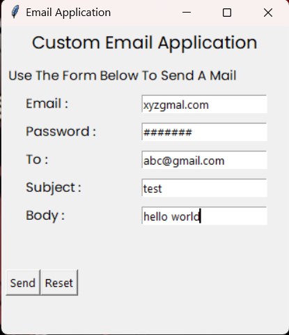

# Custom Mail Application

This is a custom mail application.

written by me under a code clause python development internship.

* language : python
* IDE : PyCharm

### Modules Used

    1. Os
    2. smtplib
    

### Functionalities
1. **Send Email Button**
* It Has Send Button To Send Email.
2. **Reset Button**
* It Has Reset Button To Clear All Data.

## Screenshots

## Note

To Use This App You Have To Allow Low Security App Access To Your Email Account.

See The Link Below To Allow Access.

[Give Access To Low Security Application](https://support.google.com/accounts/answer/6010255?hl=en#zippy=%2Cif-less-secure-app-access-is-off-for-your-account)